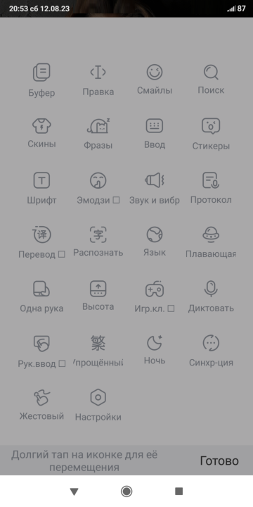

# Baidu IME OEM 10.9.101.126 Ru
## О переводе
Т.к. оригинальная версия программы (_с именем пакета **com.baidu.input**, скачивается с [оф.сайта](https://srf.baidu.com/)_) не желает нормально работать на устройствах с Android 13 после её перевода (_не помогает никакой патч отключения проверки подписи_), а старые версии (_ниже версии 10.х_) - не отображают панель инструментов, то пришлось искать версию без такого недуга и с рабочим буфером обмена. В результате была найдена версия производимая для устройств Sony (_имя пакета **com.baidu.input_oem**_). Она, конечно несколько отстаёт по функционалу от оригинальной (_на данный момент версия оригинала - 11.7.14.2, версии для Sony - 10.9.101.126_), но необходимые мне функции присутствуют.
На данный момент (12.08.2023г.) переведены основные настройки, некоторые всплывающие соообщения и дополнительное меню с ярлыками (_вызывается по иконке в верхнем левом углу клавиатуры_).

Окна, завязанные на использование интернета, преимущественно не переводились (_я даже не все места нашёл, где размещены эти тексты_).

В программе можно скачать русскоязычную (_ну и множество прочих_) раскладку, но лучше сразу поставить мой скин клавиатуры: на раскладке Пиньинь вместо латиницы на кнопках расположены русские, украинские и белорусские буквы. Ну и кроме того кроме букв добавлено до 2 дополнительных символов, вводимых свайпом влево или вправо (_свайп вверх на раскладке с нижним регистром символов вводит эту же букву в верхнем регистре, для букв из украинского и белорусского языков всё таки нужно использовать Shift_). Из встроенного магазина можно скачать 

Кроме перевода поменял некоторые дефолтные настройки программы (_благо такое код позволяет; отключил всё, что было завязано на интернет_).

## Работа с клавиатурой
### Активация клавиатуры
Чтобы начать пользоваться программой нужно войти в настройки языка (_у меня "**Расширенные настройки**" ==> "**Язык и ввод**"_). Там нужно включить саму клавиатуру (_пункт называется в MIUI10 A8 - "**Виртуальная клавиатура**"; в MIUI14 A13 - "**Управление клавиатурами**"_). Там будет "**Baidu IME Ru**", она-то Вам и нужна. После включения клавиатуры для начала её использования ещё нужно её активировать (_в MIUI10 A8 в подразделе "**Способы ввода**" будет пункт "Текущая клавиатура" где нужно будет выбрать "**Baidu IME Ru**", чуть ниже находится с пункт с такми же названием, через который можно сразу попасть в настройки клавиатуры; в MIUI14 A13 в подразделе "**Методы ввода**" выбор активной клавиатуры находится в пункте "**Текущая клавиатура**", а вход в её настройки там же, где и её включение, просто тапать нужно по названию, а не переключателю_).
После этого можно зайти в настройки программы и в разделе "**Языки и методы ввода**" включить и/или скачать нужные, выключить и удалить ненужные ненужные. Чтобы включить необходимую раскладку, нужно включить галочко напротив нужнопункта подраздела "**Доступные языки и методы ввода**", для отключения - выключить. Для загрузки - выбрать нужный вариант в подразделе "**Загружаемые языки**". Чтобы удалить ненужную раскладку, нужно сначала её выключить, а потом нажать на иконку карандаша в правом верхнем углу этого окна, после чего вы перейдёте в список раскладок, ктороые можно удалить (_просто нажать на иконку корзины напротив ненужной раскладки_).

### Добавление своих скинов в программу
Чтобы добавить свой скин (_имеют расширение ***.bds**_), нужно файл скина закинуть (_у программы почему-то отсутствует ассоциация с этим типом файлом_) по пути: `память телефона/Android/data/com.baidu.input_oem/files/skins/`. После этого можно будет выбрать добавленный скин в меню программы (_тапаете по иконке в правом верхнем углу клавиатуры и находите в меню, появившемся вместо клавиш, значок футболки_). В открывшемся меню будут 2 иконки человека: лучше выбирать цветную вверху справа, т.к. она приведёт сразу в окно выбора локального скина, серая внизу справа - это переход к локальным настройкам, где можно перейти к выбору скина, набора смайлов, словаря и шрифта. А в меню выбора скина уже будут видны превьюшки скинов, где нужно будет тапнуть на превьюшку нужного, а потом в новом окне просто нажать на кнопку подтверждения (она будет одна под большим превью).
В случае моего скина **_EngRusUkrBel_** (_в принципе можно просто загуглить название: гугл сразу выдаёт [ссылку на DimonVideo](https://dimonvideo.ru/uploader/504783), где я когда-то выкладывал данный скин, ещё есть этот скин в [теме Baidu IME на 4PDA](https://4pda.to/forum/index.php?showtopic=1052291&view=findpost&p=116445076); надо бы как-нибудь обновить там скины, т.к. я какое-то время назад делал в ней ещё изменения_) надо будет выключить все раскладки, кроме Пиньинь и Английского (_первая отвечает за кириллицу, вторая за латиницу, а остальные - преимущественно бесполезны_).

### Настройка панели инструментов
Над клавиатурой находится панель инструментов, которую можно настроить под себя (_в версии 10.х OEM доступно только изменение расположения 4 иконок, ну и то, какие иконки будут там отображаться; в версии 11.х оригинальной программы с оф.сайта также доступно изменение количества_). Для этого нужно тапнуть по иконке программы в левом верхнем углу клавиатуры, чтобы открыть доп.меню с иконками. Потом нужно прокрутить это меню в самый низ и тапнуть по единственной иконке с непереведённой подписью (_прямоугольник с шестерёнокой внутри_). Доп.меню растянется на весь экран и станет доступно изменение порядка ярлыков в нём. В панели инструментов отображаются только те, что в самом верхнем ряду. После изменения порядка жмёте кнопку "Готово" правом нижнем углу и можно пользоваться клавиатурой с перенастроенной панелью инструментов.
У меня в этой панели размещены иконки "Буфер" (_вызов окна с текстовым буфером обмена_), "Правка" (_позволяет при удержании пальца на этой иконке перемещать курсор в тексте влево/вправо в зависимости от направления смещения пальц, как и в клавиатуре от гугла_), "Смайлы" (_выбор смайлика, как и в других клавиатурах_) и "Поиск" (_поиск и перевод текста; режим переключается в панельке слева, но пока не пользовался, т.к. завязано на инет, а я клаву туда обычно не пускаю_ ^_^).

## Предложения на счёт перевода
Вы всегда можете предложить свой вариант перевода текста, если считаете, что он более корректен, чем мой.
Если вы встретили не переведённое место, то имеется вероятность, что оно никогда и не будет переведено, особенно если рядом нет переведённых фраз, т.к. тяжело искать где находятся фразы.
Вместо того, чтобы хранить локализированные тексты в **res/values**, китайцы раскидали свои фразы по куче файлов в папках **res/layout/** и **res/xml/** (_может быть где-то ещё_), поэтому в переводе v3.2 мной было переведено 98 файлов вместо всего 3: **res/values/arrays.xml**, **res/values/plurals.xml** и **res/values/strings.xml**. В более свежих версиях основной программы с этим лучше, но не скажу, что намного.
